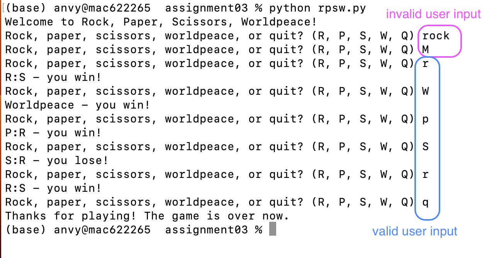

# Assignment 03

for the course [Introduction to Data Science and Programming](https://learnit.itu.dk/course/view.php?id=3022199) (Autumn 2023) at ITU

**Due: October 2, 23:59**

Before you turn this assignment in, make sure to try out your script by running it from the command line interface, and verify that everything runs as expected. Make sure that you have added your name and ITU email address as a comment to the code. **Please submit a Python script named `xxxx_rpsw.py`**, where `xxxx` is replaced by your ITU student ID.

# Rock, Paper, Scissors, Worldpeace: Rules of the game

Write a `.py` script to play an indefinite amount of Rock, Paper, Scissors, Worldpeace (RPSW) rounds against your computer. 

The rules of Rock, Paper, Scissors, Worldpeace are simple:
* Rock beats Scissors
* Scissors beat Paper
* Paper beats Rock
* Worldpeace beats everything
* if both user and computer select the same (Rock:Rock, Paper:Paper, or Scissors:Scissors), it's a tie (no one wins)

In each round of RPSW, the user gets asked to choose between Rock (`R`), Paper (`R`), Scissors (`S`), Worldpeace (`W`); or Quitting the game (`Q`). If the user selects `Q`, the game ends, and no more rounds are played. If the user selects `W`, the user wins the round; and a new round of the game starts. If the user selects `R`, `P`, or `S`, the computer also (randomly) chooses between `R`, `P` and `S`, and the user and computer moves are evaluated against each other (either the user wins; or the computer wins; or it's a tie); then a new round of the game starts. 

When ran from the CLI, your program output should look approximately like this:

    

## Instructions for your script

When writing your script, make sure that:
* You print out a welcome message - only once, in the very beginning of the game before the first round: `Welcome to Rock, Paper, Scissors, Worldpeace!`
* Next, at the start of each game round, the user is asked for input with the prompt `Rock, paper, scissors, worldpeace, or quit? (R, P, S, W, Q)`
* Accepted user input are the letters, both in lower and upper case: `R`, `P`, `S`, `W`, `Q`, `r`, `p`, `s`, `w`, `q`
* If the user inputs anything but these letters, they get asked for their input again
* As soon as the user provides valid input, one of the following happens:
    * the game ends with the message `Thanks for playing! The game is over now.`
    * the message `Worldpeace - you win!` is printed; and a next round of the game starts (i.e. user is prompted for input again)
    * `X:Y - you lose!` is printed (where X is the user move and Y is the computer move); and a next round of the game starts
    * `X:Y - you win!` is printed; and a next round of the game starts
    * `X:Y - it's a tie!` is printed; and a next round of the game starts
* Only the user (not the computer) is allowed to play the "Worldpeace" moves
* Make sure to put **comments** in your code and, if you use functions, make sure they have **docstrings** 

## Code skeleton

We provide a code skeleton [`xxxx_rpsw_withhints.py`](https://github.com/anastassiavybornova/pythoncrashcourse/blob/main/assignments/assignment03/xxxx_rpsw_withhints.py); you are *allowed* to use it, but you don't have to. (There are many possible solutions to this task - the code structure suggested in the code skeleton is only one of many possible ways!) If you prefer not to get any hints, use [`xxxx_rpsw_withouthints.py`](https://github.com/anastassiavybornova/pythoncrashcourse/blob/main/assignments/assignment03/xxxx_rpsw_withouthints.py) instead.

## Hints

Here, we collected some hints, which you are *allowed* to use (but don't have to).

* The game should be played an indefinite amount of times - it should only end once the user types `Q` (for Quit); this calls for a `while` loop with a conditional `break` that will depend on the user input.
* Since we want to accept both upper and lower case letters, the string methods `.upper()` or `.lower()` can make the task easier
* For printing out the evaluation messages, consider using string formatting `f"{variable} text {variable}..."`
* The random choice of the computer can be simulated with a function from the `random` module, for example `random.choice()`
* To not lose overview of the many `if-else` statements in your code, it's a good idea to use separate **functions** for subtasks (for example, separate functions for the user choice in a round; the computer choice in a round; and the evaluation of user vs. computer choice). If you use functions, define them in the beginning of your script, right after importing the needed modules.